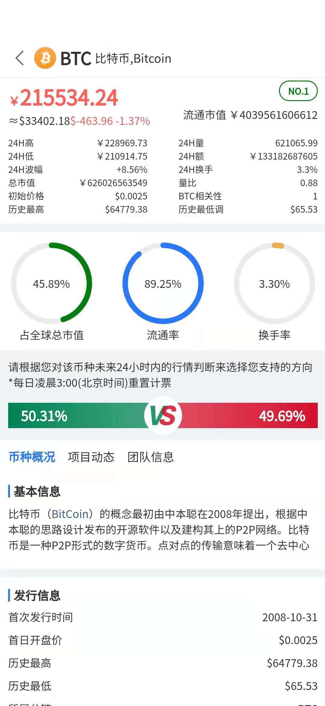
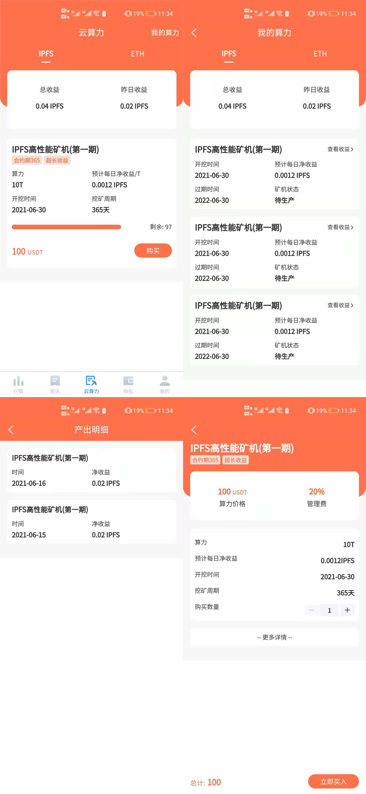
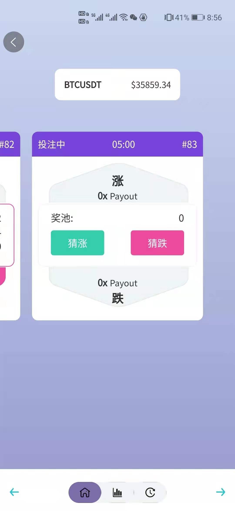
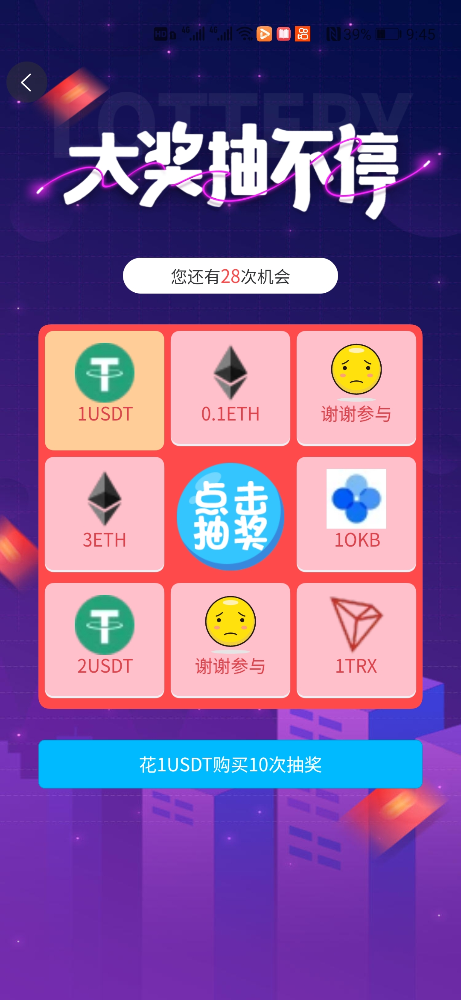
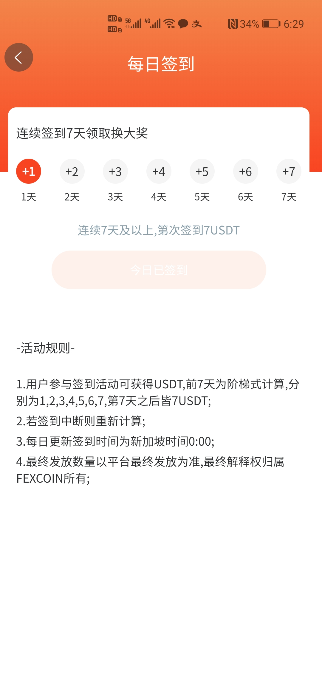
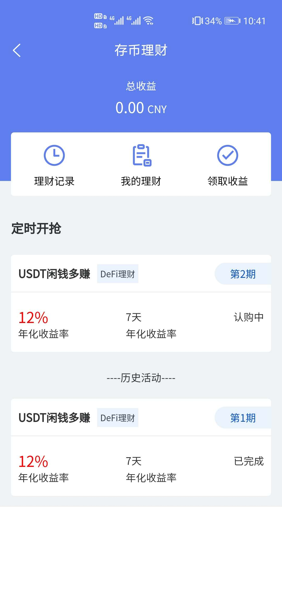
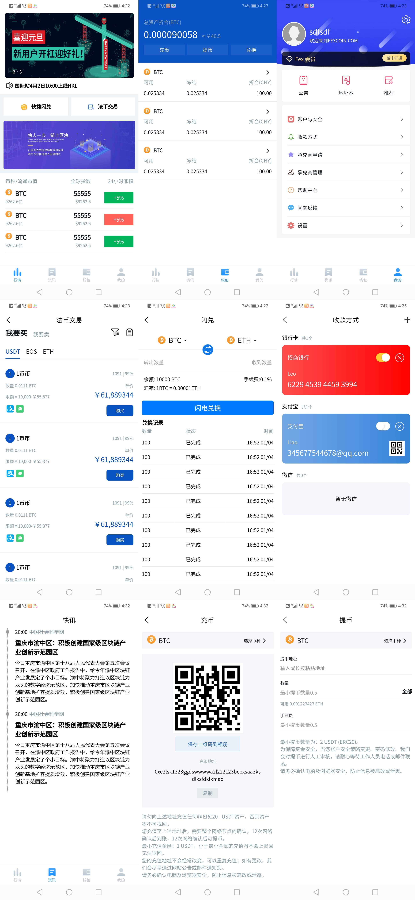

# FexCoin钱包是一款存储加密货币的手机钱包, 属于区块链数字资产管理工具

#### 特别声明
本软件属于技术开源软件, 任何使用本源码从事商业活动，对别人和自己造成损失的，本人概不负责！

#### 开源不易,请作者喝杯奶茶! ≧◠◡◠≦
##### TRX: TVhL64bjXRAkrM1qbcZhi8EGCa2pZq8wgM
##### ETH: 0x4fA38fD5BA5c1054E48E036EBd5ac5b34D76Cec7
##### EOS: fexcoin54321

### Android测试包下载: [点击下载](https://fexcoin.oss-cn-shenzhen.aliyuncs.com/upload/apk/fexcoin.apk)

### 扫一扫下载
 

### H5体验
 

#### 技术交流社区

##### 微信群 &nbsp;&nbsp;&nbsp;&nbsp;&nbsp;&nbsp;&nbsp;&nbsp;&nbsp;&nbsp;&nbsp;&nbsp;&nbsp;&nbsp;&nbsp;&nbsp;&nbsp;&nbsp;&nbsp;&nbsp;&nbsp;&nbsp;&nbsp;&nbsp;&nbsp;&nbsp;&nbsp;&nbsp;&nbsp;&nbsp;QQ群
 
 

#### 功能规划
1. 资产托管
2. 闪电兑换
3. 法币交易
4. 行情资讯
5. 存币理财
6. 行情预言机
7. 云算力

#### 版本更新

##### 2021-11-19: 新增多语言需求

##### 2021-10-09: 新增登录滑块验证功能

##### 2021-09-07: 新增身份认证

##### 2021-06-25: 新增币种信息展示
 

##### 2021-06-16: 新增云算力需求
 

##### 2021-06-03: 新增行情预言机需求
 

##### 2021-05-13: 新增APP版本更新

##### 2021-03-03: 新增抽奖需求
 

##### 2021-01-24: 新增签到需求
 

##### 2020-10-24: 新增存币理财需求
 

##### 2020-06-14: 接入火币K线行情
 

 

#### 安装教程

1. 下载HbuilderX
2. 手机USB连接电脑
3. 打开开发者模式, USB调试
4. 打开HbuilderX, 选择 运行 -> 运行到手机或模拟器 -> 选择连接的手机  等待安装

#### 使用说明

1. 将项目拖入[HbuilderX](http://www.dcloud.io/hbuilderx.html) 
2. 运行命令 
   npm install
   
3. [uni-app教程](https://uniapp.dcloud.io) 

#### 推荐作者小程序
 
 
 
 

#### 参与贡献

暂无

